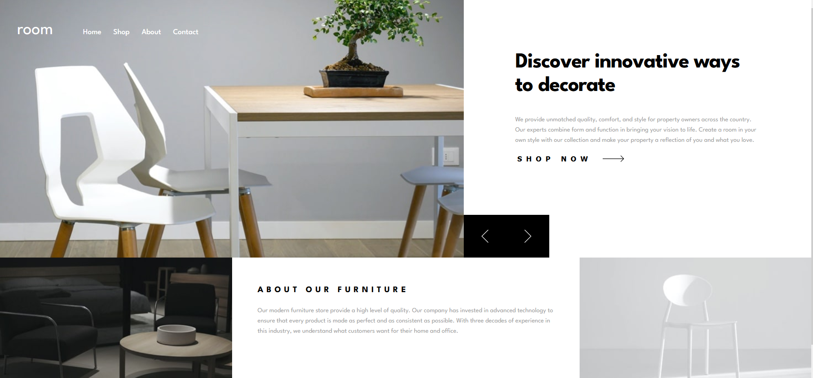
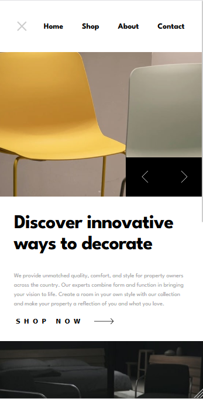
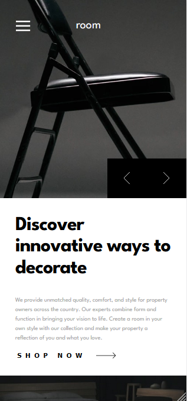

# Frontend Mentor - Space Tourism Website

This is a solution to the [Room Homepage challenge on Frontend Mentor](https://www.frontendmentor.io/challenges/room-homepage-BtdBY_ENq).

## Table of contents

- [Overview](#overview)
  - [The challenge](#the-challenge)
  - [Screenshots](#screenshots)
- [My process](#my-process)
  - [Built with](#built-with)
  - [What I learned](#what-i-learned)
  - [Useful resources](#useful-resources)
- [Author](#author)

## Overview

### The challenge

Users should be able to:

- View the optimal layout for the site depending on their device's screen size
- See hover states for all interactive elements on the page
- ~~Navigate the slider using either their mouse/trackpad or keyboard~~ (might add this later)

### Screenshots

<p align="left" style="width: 70%">
  
  
</p>
<p align="left" style="width: 20%">



</p>
<br/>
<br/>
<br/>

## My process

### Built with

- [Vue.js](https://vuejs.org/)
- [SCSS](https://sass-lang.com/)
- [Swiper js](https://swiperjs.com/)

### What I learned

In this challange I fouces on animations and transitions. Even though there weren't too many in the end, it was still a good thing focusing a little bit more on that aspect. It is also the very first project I build in Vue.js! It wasn't easy using the new syntax and the functionalities of vue that don't exist in react... but in the end I think I did alright. I especially liked the `<transition>` tag and what you can do with it.

I didn't do any crazy stuff with this project, but I learned a lot by only using the basic functions of new things.

```html
<transition name="scale">
  <HamburgerIcon class="nav__icon nav__icon--hamburger" v-show="!navOpen" />
</transition>
```

```scss
// Hamburger to Close Icon Animation
.scale-enter-active,
.scale-leave-active {
  transition: transform 0.2s ease;
}

.scale-enter-from,
.scale-leave-to {
  transform: scale(0);
}

.scale-enter-to,
.scale-leave-from {
  transform: scale(1);
}
```

### Useful resources

- [vue.js built in transitions](https://vuejs.org/guide/built-ins/transition)
- [inspiration for the mobile menu](https://codepen.io/ysk2645/pen/wvBabpe)

## Author

Annalisa Comin
